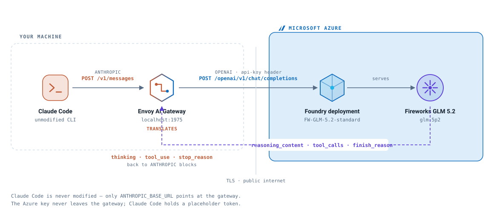

# Architecture



Four components. Claude Code and the gateway run on your machine; the deployment
and the model run in your Azure subscription.

```
Claude Code  →  Envoy AI Gateway  ┊  Foundry deployment  →  Fireworks GLM 5.2
   Anthropic     localhost:1975   ┊  FW-GLM-5.2-standard      glm-5p2
                  TRANSLATES      ┊
                                 TLS
```

## What each part does

**Claude Code** — unmodified. The only change is `ANTHROPIC_BASE_URL` pointing at
the gateway instead of `api.anthropic.com`. It cannot tell it is not talking to
Anthropic, because the response it gets back is shaped exactly like one.

**Envoy AI Gateway** — the only component that knows both dialects. It converts
`POST /v1/messages` into `POST /openai/v1/chat/completions` on the way out and
converts the response back on the way in, including streaming. It also rewrites
the model name to the Foundry deployment name and injects the Azure `api-key`
header, so the key never reaches Claude Code.

**Foundry deployment** — `FW-GLM-5.2-standard`. Note this is the *deployment*
name, not the model name; the portal usually appends a suffix.

**Fireworks GLM 5.2** — `accounts/fireworks/models/glm-5p2`, served by Fireworks
inside Azure and billed through your Azure subscription.

## The response path

One synchronous HTTP chain, not a separate send. Claude Code holds a connection
open to `localhost:1975` and the gateway holds one open to Foundry; the response
unwinds back along the same path and the gateway translates it in place.

With streaming — which Claude Code always uses — the conversion happens **in
flight**, chunk by chunk. OpenAI SSE chunks arrive at one end and Anthropic
`content_block_delta` events leave the other, continuously. That is why
time-to-first-token stays around 400 ms while a full turn takes a couple of
seconds.

Nothing in this path reaches Anthropic. Anthropic supplies the client; Azure
serves the model.

## One thing you inherit rather than configure

You deploy a model, not a gateway — but Azure still terminates the request on its
own edge before Fireworks sees it. The response headers give it away:

```
apim-request-id: bcfeae9b-46cd-4f14-8fa2-0218e9e45734
x-ratelimit-limit-requests: 66
azureai-fe-requested-service-tier: PayGo
```

Two consequences worth knowing:

- **Every `fireworks-*` response header is stripped** and replaced with Azure's
  own. Anything you want to observe about the upstream has to come from the
  response *body* — for example `usage.prompt_tokens_details.cached_tokens` for
  prompt-cache hits.
- **A per-minute request cap is enforced there**, not by you. Bursty scripts hit
  `429` and the retries land on cold replicas, which looks a lot like a
  performance problem until you pace them.

## Source

`architecture.svg` is hand-authored SVG — no build step, no external references,
and it renders inline on GitHub. Edit it directly.
